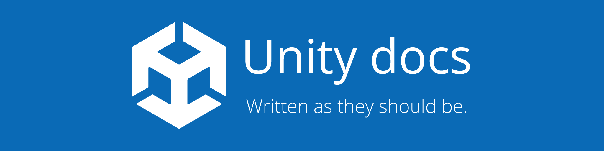

This repository is home to a work-in-progress passion project which aims to rewrite the entirety of the
[Unity documentation](https://docs.unity3d.com/ScriptReference/) from scratch in a style which closely resembles and
pays homage to [MSDN](https://docs.microsoft.com/en-us/dotnet/).

## Why?
Many people find the existing Unity documentation to be lackluster with poorly written summaries, giving virtually no
attention to the declaration of types and members nor the assemblies and namespaces in which they're defined.

MSDN is considered by many to be a prime example of documentation done right. With this project, it is aspired that
Unity developers will be able to find consistency and reliability in better-written and better-structured documentation.

## Building
This project makes use of both .NET and Node build pipelines.

The front-end static source files (TypeScript, SCSS) are found within the `wwwsrc` directory, and can be built
with `gulp`. These static assets will be placed into the `Host/wwwroot` directory.

The ASP.NET Core project can be built with `dotnet build`.

```sh
$ npm i
$ gulp
$ dotnet build
```

## Contributing
Contributions will be welcome in the near future. Watch this space.

## License
This repository is licensed under [MIT](LICENSE.md).
